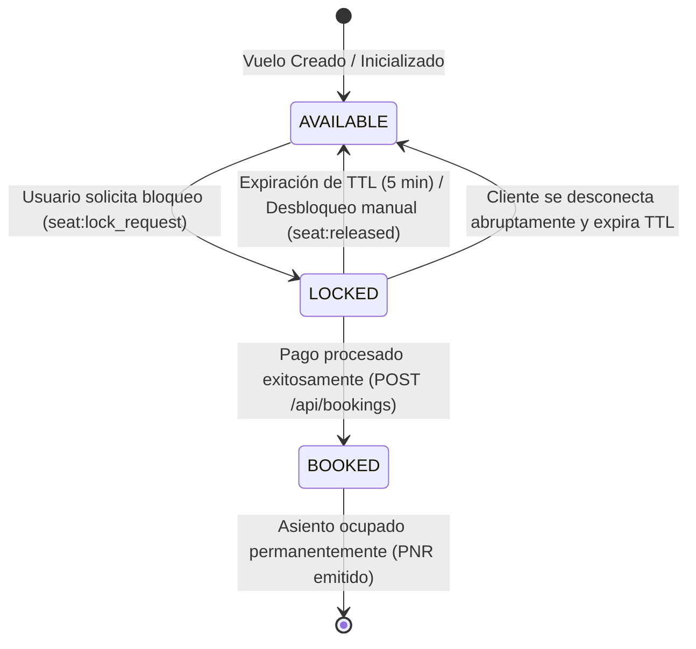
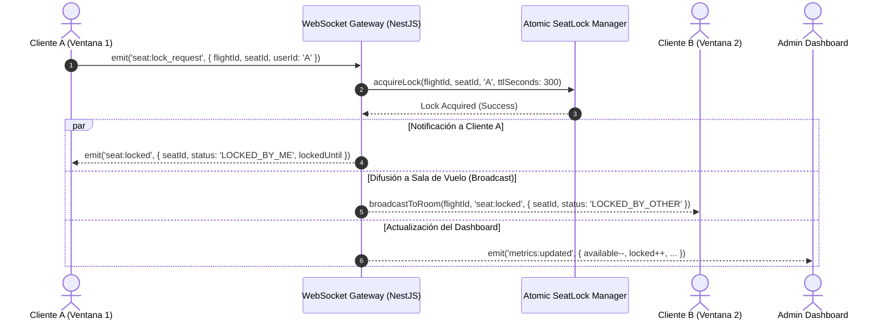
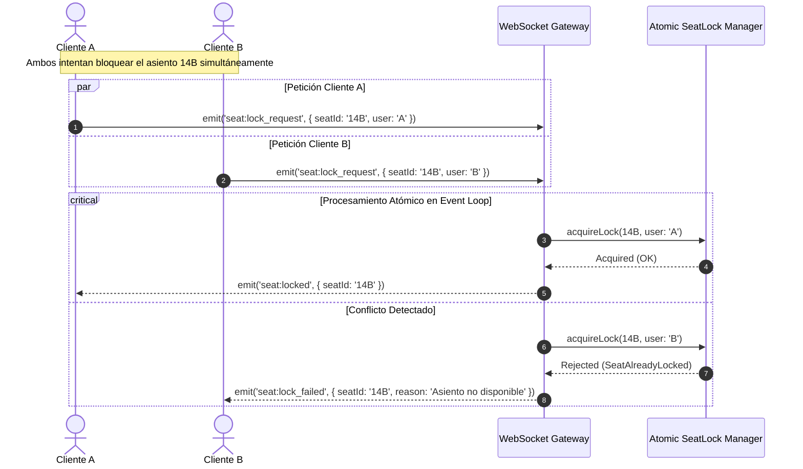
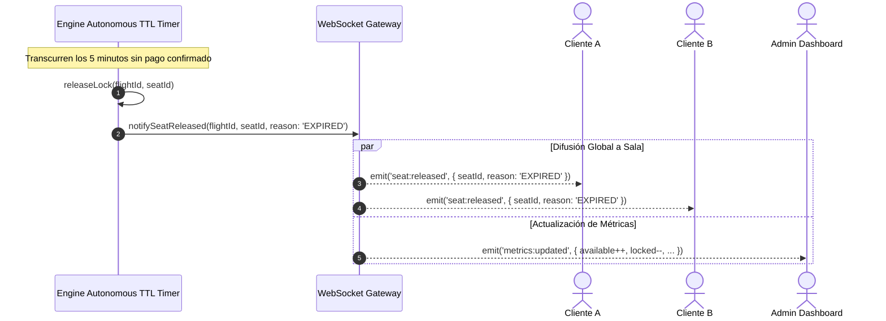

# Diseño Técnico: Sistema de Reservas de Vuelos en Tiempo Real

> **Feature:** `flight-reservation`  
> **Patrón:** Hexagonal (Puertos y Adaptadores) & Event-Driven Architecture  
> **Fecha:** 2026-09-24

---

## 1. Diagrama de Flujo y Máquina de Estados del Asiento

---

## 2. Diagramas de Secuencia

### 2.1. Bloqueo Atómico y Propagación en Tiempo Real (HU2)

### 2.2. Prevención de Condición de Carrera (*Anti Double-Booking*)

### 2.3. Expiración Autónoma por Servidor (TTL)

---

## 3. Estrategia de Salas de WebSockets (Multiplexación por Vuelo)

Para optimizar el uso de red y evitar sobrecargar a clientes con eventos irrelevantes:
- Cuando un usuario entra a ver la cabina del vuelo `AV204`, el cliente emite `flight:join` con `{ flightId: 'AV204' }`.
- El Gateway de NestJS suscribe ese socket a la sala `flight_AV204` (`socket.join('flight_' + flightId)`).
- Todos los eventos de asientos (`seat:locked`, `seat:released`, `seat:booked`) se emiten exclusivamente a la sala correspondiente (`server.to('flight_' + flightId).emit(...)`).
- Los clientes suscritos al Dashboard administrativo se unen a la sala `metrics_feed` para recibir los agregados consolidados.

---

## 4. Agregación de Métricas en Tiempo Real (HU4)

El servicio `MetricsService` mantiene en memoria contadores O(1) por vuelo:
$$\text{occupancyPercentage} = \left( \frac{\text{bookedSeats} + \text{lockedSeats}}{\text{totalSeats}} \right) \times 100$$
$$\text{revenueEstimated} = \sum_{\text{booked}} \text{seatPrice}$$

Cada mutación atómica de asiento actualiza de inmediato estas variables y emite `metrics:updated`.
