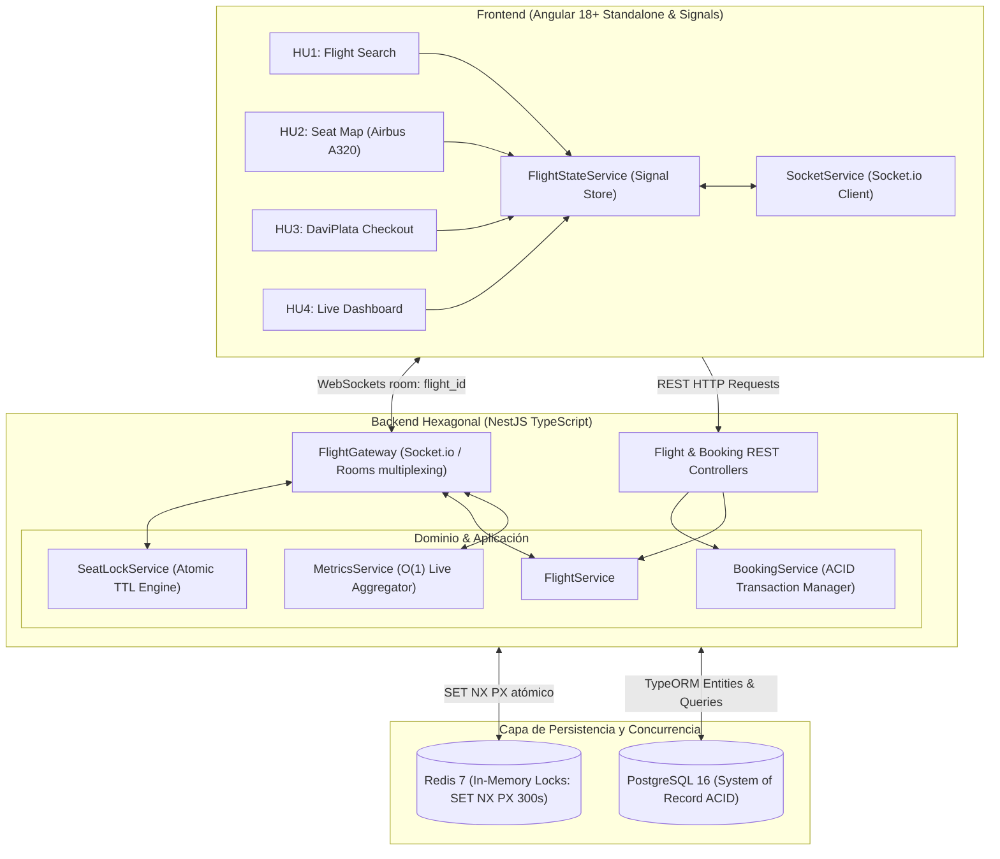

# ✈️ Sistema de Reservas de Vuelos en Tiempo Real — Davivienda Air

> **Prueba Técnica:** Especialista Desarrollador Líder Técnico — Banco Davivienda  
> **Candidato:** Aspirante a Líder Técnico  
> **Metodología:** Spec-Driven Development (SDD) & Clean Architecture  
> **Stack Tecnológico:** Angular 18+ (Signals, OnPush, Standalone) | NestJS (Arquitectura Hexagonal) | Redis (Atomic Locks `SET NX PX`) | PostgreSQL (ACID) | Socket.io | Tailwind CSS

---

## 📋 Resumen Ejecutivo de la Solución

Solución de nivel empresarial para el reto técnico de **Especialista Desarrollador Líder Técnico** de Banco Davivienda. El sistema implementa una plataforma de reservas de vuelos con sincronización bidireccional en tiempo real, mapa interactivo de cabina de aeronaves (Airbus A320), prevención atómica de sobreventa (*double-booking*), checkout con simulación de **DaviPlata** y emisión de código PNR, junto con un **Dashboard Ejecutivo de Ocupación** con cálculo reactivo $O(1)$.

### 🌟 Cumplimiento de Historias de Usuario (100%)

| Historia de Usuario | Alcance Implementado | Evidencia Técnica |
| :--- | :--- | :--- |
| **HU1: Consulta y Estado de Vuelos** | Búsqueda filtrada (Origen, Destino, Fecha) y sincronización reactiva de estados operativos (`ON_TIME`, `DELAYED`, `CANCELLED`). Contador de asientos disponibles en tiempo real. | `FlightSearchComponent` + `flight:status_updated` |
| **HU2: Selección de Asientos y Concurrencia** | Mapa de cabina Airbus A320 (30 filas, 180 asientos). Bloqueo atómico exclusivo con Redis (`SET NX PX`), temporizador regresivo autónomo de 5 minutos (300s TTL) y rechazo inmediato de colisiones. | `SeatMapComponent` + `SeatLockService` |
| **HU3: Checkout y Emisión de Tiquetes (PNR)** | Formulario de pasajero, pago simulado con DaviPlata/Tarjeta, transacción ACID estricta en PostgreSQL, emisión de código alfanumérico PNR y pasabordo digital imprimible. | `CheckoutComponent` + `BookingService` |
| **HU4: Dashboard de Ocupación en Vivo** | Monitoreo en tiempo real de tasa de ocupación, inventario disponible/bloqueado/vendido, desglose por clase de cabina y feed de auditoría de eventos en vivo. | `DashboardComponent` + `MetricsService` |

---

## 🏛️ Arquitectura del Sistema

La solución adopta un **Monolito Modular con Arquitectura Hexagonal (Clean Architecture / Ports & Adapters)**, evitando la latencia y complejidad operativa innecesaria de microservicios distribuidos para la prueba técnica, pero manteniendo desacopladas las fronteras de dominio para una migración limpia si la escala lo requiere.



---

## 🔒 Mecanismo de Bloqueo Atómico y Anti-Doble Reserva

Para garantizar consistencia estricta bajo alta concurrencia:
1. **Adquisición Atómica:** Al hacer click en un asiento disponible, se ejecuta en Redis el comando nativo:
   $$\text{SET}\ \texttt{lock:flight:}\langle flightId\rangle\texttt{:seat:}\langle seatId\rangle\ \langle userId\rangle\ \text{NX}\ \text{PX}\ 300000$$
   * `NX`: Concede el bloqueo **únicamente** si la llave no existe previamente.
   * `PX 300000`: Establece un tiempo de vida (TTL) improrrogable de 5 minutos (300 segundos).
2. **Rechazo Inmediato:** Si dos usuarios intentan reservar el mismo asiento en el mismo milisegundo, la operación de Redis retorna `null` para el segundo usuario. El backend emite `seat:lock_failed` con motivo `DOUBLE-BOOKING PREVENTED`, informando al usuario en menos de 10ms.
3. **Liberación Autónoma:** El temporizador reside en el backend (Redis). Si el navegador se cierra o el usuario no completa el pago en 5 minutos, la llave expira automáticamente y el asiento vuelve a estar disponible para todos los clientes conectados.
4. **Persistencia ACID:** Al completar el checkout, una transacción en PostgreSQL confirma la reserva, emite el PNR y pasa el asiento permanentemente a estado `BOOKED`.

---

## 🎨 Identidad Visual Oficial Davivienda

La interfaz fue diseñada respetando la guía de marca y tokens visuales de **Banco Davivienda**:
* **Rojo Davivienda Principal:** `#ED1C24`
* **Rojo DaviPlata:** `#E20613`
* **Amarillo DaviPuntos / Ejecutiva:** `#FFB800`
* **Verde Esmeralda (Disponible):** `#10B981`
* **Gris Ocupado:** `#9CA3AF`
* **Tipografía:** Inter (sans-serif legible y moderna)
* **Selector Multiusuario (Demo Mode):** Permite alternar entre perfiles (Carlos Mendoza, Ana Rodríguez, Felipe Gómez) para verificar concurrencia multi-cliente en una sola máquina.

---

## 🚀 Puesta en Marcha

### Prerrequisitos
* **Docker y Docker Compose** (Recomendado)
* O **Node.js `>= 20.x`**, **npm `>= 10.x`**, Redis local y PostgreSQL.

---

### Opción 1: Ejecución con Docker Compose (Recomendada)

Inicia PostgreSQL, Redis, Backend NestJS y Frontend Angular con un solo comando:

```bash
docker compose up --build
```

* 🌐 **Frontend (Angular 18):** [http://localhost:4200](http://localhost:4200)
* ⚙️ **Backend REST & WebSockets:** [http://localhost:3000](http://localhost:3000)
* 📊 **PostgreSQL:** `localhost:5432` (`davivienda` / `davivienda123`)
* ⚡ **Redis:** `localhost:6379`

---

### Opción 2: Ejecución Local en Desarrollo

1. **Instalar dependencias del monorepo:**
   ```bash
   npm install
   ```

2. **Compilar contratos compartidos (`@davivienda/shared`):**
   ```bash
   npm run build:shared
   ```

3. **Iniciar el Backend (NestJS):**
   *(Se autoconecta a Redis local en localhost:6379 o activa el motor fallback en memoria)*
   ```bash
   npm run start:backend
   ```

4. **Iniciar el Frontend (Angular 18):**
   ```bash
   npm run start:frontend
   ```
   *Accede en tu navegador a `http://localhost:4200`.*

---

## 🧪 Pruebas Automatizadas y Gates de Calidad

El proyecto cuenta con una suite completa de pruebas unitarias que validan la lógica de concurrencia, TTL atómico, emisión de PNR y reactividad fina de Signals:

```bash
# Ejecutar suite de pruebas unitarias
npm test
```

### Resultados de la Suite de Pruebas:
```text
PASS src/modules/seat/seat-lock.service.spec.ts (5 tests)
  ✓ debe conceder un bloqueo exclusivo cuando el asiento está disponible
  ✓ [DOUBLE-BOOKING PREVENTED] debe rechazar un segundo bloqueo concurrente sobre el mismo asiento
  ✓ debe liberar el bloqueo voluntariamente por el usuario propietario
  ✓ debe denegar la liberación del bloqueo a un usuario ajeno
  ✓ debe gestionar múltiples bloqueos concurrentes sin colisiones

PASS src/modules/flight/flight.service.spec.ts (4 tests)
  ✓ debe listar vuelos filtrados por origen y destino
  ✓ debe generar la cabina completa de 180 asientos para el Airbus A320neo
  ✓ debe reflejar asientos bloqueados por Redis en la matriz de cabina
  ✓ debe emitir evento reactivo al actualizar el estado de un vuelo (HU1)

PASS src/modules/booking/booking.service.spec.ts (3 tests)
  ✓ debe rechazar compra si el asiento NO está previamente bloqueado por el usuario
  ✓ debe confirmar compra, emitir PNR y pasar asiento a BOOKED permanentemente cuando el lock es válido
  ✓ debe rechazar si otro usuario intenta pagar un asiento bloqueado por un tercero

Test Suites: 3 passed, 3 total
Tests:       12 passed, 12 total
```

---

## 👥 Guía de Demostración para Evaluadores (Testing Multi-Pestaña)

Para validar la sincronización en vivo y la prevención de sobre-reservas:

1. **Abrir dos ventanas del navegador** (ej: ventana normal y ventana de incógnito, o Chrome y Firefox) en `http://localhost:4200`.
2. **Seleccionar identidades distintas:** En la barra superior (Navbar), en la ventana A selecciona *"Carlos Mendoza"* y en la ventana B selecciona *"Ana Rodríguez"*.
3. **Ingresar al vuelo `DV-204`** en ambas ventanas.
4. **Verificar el Bloqueo Atómico:**
   * En la ventana A, haz clic en el asiento **`12B`**.
   * Observa que en la ventana A se vuelve **Rojo** con un temporizador regresivo de 5 minutos (`04:59`).
   * Observa que **instantáneamente en la ventana B**, sin recargar, el asiento `12B` se vuelve **Amarillo** (bloqueado por otro usuario con ícono de candado 🔒).
5. **Verificar Prevención de Doble Reserva:**
   * Intenta hacer clic en el asiento `12B` desde la ventana B.
   * La acción está deshabilitada y protegida por el backend.
6. **Verificar el Checkout DaviPlata:**
   * En la ventana A, presiona *"Continuar al Pago"*.
   * Selecciona **DaviPlata** y confirma la compra.
   * Recibirás el **Pasabordo Digital con código PNR oficial** (ej: `DV-8X9K2`).
   * En la ventana B, el asiento pasa automáticamente a **Gris (Ocupado permanentemente)**.
7. **Verificar el Dashboard:**
   * Abre la pestaña *"Dashboard de Ocupación"* para ver los KPIs reactivos y el feed de eventos en vivo.
8. **Simulación de Cambio de Estado Operativo (HU1):**
   * En el listado de vuelos, haz clic en el botón `⚡` junto a cualquier vuelo y selecciona *"Retrasado (DELAYED)"*.
   * Observa la actualización inmediata en todas las pantallas conectadas.

---

## 📁 Estructura del Repositorio

```text
.
├── .specs/                         # Especificaciones SDD (spec, design, tasks, STATE)
│   ├── STATE.md                    # Registro de Decisiones de Arquitectura (ADRs)
│   └── features/flight-reservation/
│       ├── spec.md                 # Criterios de aceptación en notación EARS
│       ├── design.md               # Diagramas de secuencia y topología de salas WS
│       └── tasks.md                # Matriz de cobertura y desglose de tareas atómicas
├── backend/                        # Monolito Modular Hexagonal en NestJS
│   ├── src/
│   │   ├── database/               # Entidades TypeORM y Seeder automático
│   │   ├── gateway/                # WebSocket Gateway con multiplexación de salas
│   │   └── modules/
│   │       ├── redis/              # Servicio de conexión y fallback Redis
│   │       ├── seat/               # Motor de bloqueo atómico con TTL autónomo
│   │       ├── flight/             # Catálogo de vuelos y mapa de cabina
│   │       ├── booking/            # Motor de checkout y emisión de PNR
│   │       └── metrics/            # Agregador reactivo de ocupación O(1)
├── frontend/                       # Aplicación Angular 18+ (Standalone & Signals)
│   ├── src/app/
│   │   ├── core/
│   │   │   ├── services/           # SocketService, FlightApiService, UserSessionService
│   │   │   └── state/              # FlightStateService (Signal Store reactivo)
│   │   ├── features/
│   │   │   ├── flight-search/      # HU1: Búsqueda y estado de vuelos en vivo
│   │   │   ├── seat-map/           # HU2: Mapa interactivo Airbus A320 con countdown
│   │   │   ├── checkout/           # HU3: Pago DaviPlata y pasabordo digital
│   │   │   └── dashboard/          # HU4: Dashboard ejecutivo de ocupación en vivo
│   │   └── shared/                 # Navbar con selector de personas y toasts
├── shared/                         # Contratos compartidos y tipado estricto
│   ├── src/
│   │   ├── enums/                  # FlightStatus, SeatStatus, SeatClass
│   │   ├── models/                 # Flight, Seat, Booking, FlightMetrics
│   │   ├── dtos/                   # CreateBookingDto, SearchFlightsDto, etc.
│   │   └── events/                 # Eventos tipados Socket.io
├── docs/                           # Documentación técnica complementaria
│   ├── architecture.md             # Justificación técnica y trade-offs
│   └── ia.md                       # Informe de uso de IA y decisiones de ingeniería
├── docker-compose.yml              # Orquestación completa (Postgres, Redis, App)
└── README.md                       # Guía de inicio rápido y presentación técnica
```
