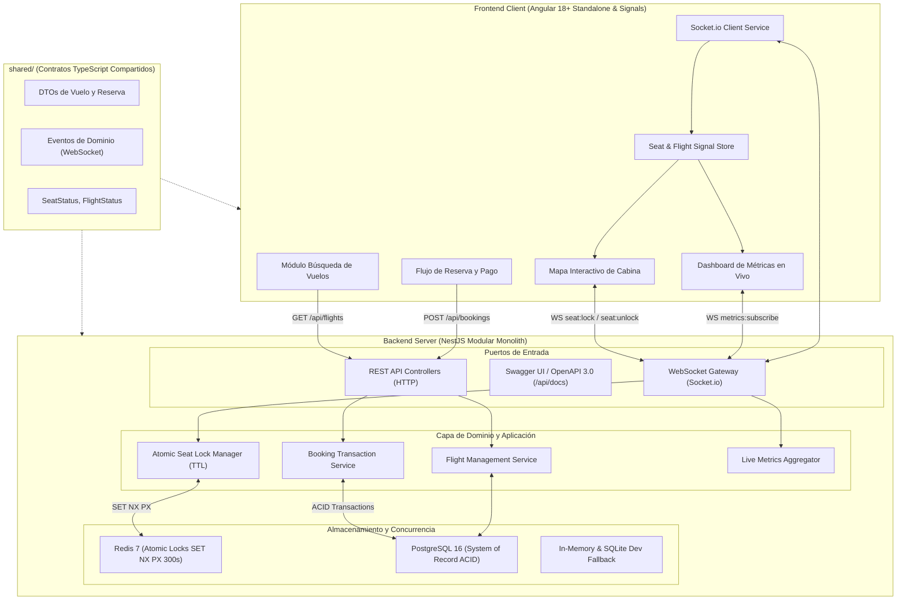

# Documento de Diseño y Decisiones de Arquitectura

> **Sistema:** Plataforma de Reservas de Vuelos en Tiempo Real  
> **Rol:** Especialista Desarrollador Líder Técnico — Davivienda  
> **Patrón Arquitectónico:** Monolito Modular con Arquitectura Limpia (Hexagonal) y Concurrencia Basada en Eventos

---

## 1. Diagrama de Arquitectura y Flujo de Componentes



---

## 2. Justificación de la Arquitectura Elegida

Se seleccionó un **Monolito Modular con principios de Clean Architecture (Hexagonal)** por las siguientes razones:

1. **Alineación con el problema y Time-to-Market:**
   - La prueba requiere un prototipo funcional enfocado en **concurrencia, tiempo real y experiencia de usuario fluida**.
   - Un enfoque de microservicios distribuidos para este alcance introduciría sobrecarga innecesaria (latencia de red entre servicios, orquestación de red, consistencia eventual compleja), distrayendo del objetivo central del reto.
2. **Modularidad estricta y bajo acoplamiento:**
   - Cada dominio (`flight`, `booking`, `seats`, `metrics`) está aislado en su propio módulo con límites claros de responsabilidad.
   - Si en el futuro el banco requiere extraer el motor de reservas como microservicio independiente, los límites ya están desacoplados.
3. **Mantenibilidad y Gobernanza de Squads:**
   - Facilita la adopción de estándares por parte del equipo de desarrollo, centralizando contratos e impidiendo dependencias circulares.

---

## 3. Manejo de Concurrencia y Estado en Tiempo Real

### 3.1. Prevención de Doble Reserva (*Double Booking*)
El principal desafío técnico es garantizar que **dos usuarios no puedan bloquear o reservar el mismo asiento simultáneamente**, incluso si interactúan exactamente en el mismo milisegundo.

* **Fuente Única de Verdad en Backend:** El frontend no asume el éxito de una operación. Solo renderiza la confirmación cuando el backend valida y emite la respuesta.
* **Operación Atómica de Bloqueo:**
  - El motor de bloqueo implementa un mecanismo atómico (*Compare-And-Swap / Mutex*) sobre el identificador del asiento (`flightId:seatNumber`).
  - Si el asiento está en estado `AVAILABLE`, se marca como `LOCKED` asignándole el `userId` y un timestamp de expiración.
  - Si otra solicitud llega simultáneamente, se rechaza inmediatamente con un error de conflicto (`409 Conflict` / evento `seat:lock_failed`).

### 3.2. Ciclo de Vida del Bloqueo Temporal (TTL Autónomo)
* **Autonomía del Servidor:** La expiración del bloqueo (5 a 10 minutos) no depende del navegador cliente.
* **Mecanismo de Desbloqueo Automático:**
  - Al bloquear un asiento, se agenda una tarea de expiración con TTL.
  - Al cumplirse el tiempo sin confirmación de pago, el asiento transiciona automáticamente de `LOCKED` a `AVAILABLE`.
  - El backend emite el evento global `seat:released` a todos los clientes suscritos al vuelo, reactivando la disponibilidad en tiempo real.
* **Manejo de Desconexión Abrupta:** Si el socket del cliente se desconecta, se mantiene el bloqueo durante el remanente de la ventana de reserva para permitir reconexión, o se libera si no hay sesión activa.

---

## 4. Decisiones Técnicas Clave

| Capa / Componente | Tecnología Seleccionada | Justificación Técnica |
| :--- | :--- | :--- |
| **Frontend** | Angular 18+ (Standalone + Signals) | Requisito indispensable de la vacante. Máximo rendimiento de renderizado en grillas interactivas gracias a la reactividad de grano fino con Signals. |
| **Backend** | NestJS (TypeScript) | Ecosistema modular enterprise, tipado estricto, soporte nativo de WebSockets y compatibilidad directa con DTOs compartidos. |
| **Tiempo Real** | WebSockets (Socket.io) | Manejo bidireccional eficiente, soporte nativo de *Rooms* (canales por vuelo) y reconexión automática resiliente. |
| **Tipado Compartido** | Paquete `shared/` | Garantía de consistencia de contratos (Single Source of Truth) entre cliente y servidor. |
| **Estilos UI** | Tailwind CSS | Flexibilidad inmediata para modelar la cabina de avión, estados cromáticos interactivos y micro-interacciones. |
| **Persistencia / Estado** | Redis (`SET NX PX` 300s TTL) + PostgreSQL 16 (ACID) | Locks atómicos de alta velocidad en Redis sin riesgo de sobreventa y persistencia relacional estricta para vuelos, reservas y pagos (con fallback SQLite local). |

---

## 5. Sistema de Diseño UI/UX — Identidad Davivienda y Pantallas Stitch

La interfaz de usuario fue diseñada respetando la identidad institucional del **Banco Davivienda** y prototipada a través del MCP de **Stitch** (Proyecto ID: `14151116527474714026`).

### 5.1. Paleta de Colores y Tokens Institucionales

| Token | Código HEX | Rol en la Interfaz |
| :--- | :--- | :--- |
| **Davivienda Red (Primario)** | `#ED1C24` | Botones de acción principal (CTA), bordes de estado activo, barras de acento y avisos de urgencia. |
| **DaviPlata Red (Acento)** | `#E20613` | Distintivo de pago rápido en 1 clic y confirmación OTP. |
| **DaviPuntos Gold (Secundario)** | `#FFB800` / `#F59E0B` | Asiento seleccionado temporalmente por el usuario ("Tu Asiento"), badges de fidelización y tags de alerta. |
| **Emerald Green (Estado)** | `#10B981` | Asientos disponibles para selección, estado de vuelo `A TIEMPO` y telemetría de WebSocket activa. |
| **Dark Charcoal (Texto)** | `#1F2937` / `#111827` | Tipografía de alta legibilidad sobre fondos claros. |
| **Slate Gray (Deshabilitado)** | `#64748B` / `#94A3B8` | Asientos vendidos/ocupados de forma permanente (`OCCUPIED`). |
| **Surface Pure / Clean** | `#FFFFFF` / `#F8FAFC` | Tarjetas elevadas con sombras suaves y estética moderna bancaria. |

### 5.2. Pantallas Prototipadas en Stitch (MCP)

1. **HU1: Búsqueda y Resultados en Tiempo Real (`Screen ID: 6658db2f90684be4b5eff0e577096228`)**
   - Buscador de rutas con selector de vuelos (Bogotá BOG ➔ Medellín MDE), panel de filtros y tarjetas de vuelos con badges de estado dinámicos (`A TIEMPO`, `DEMORADO`, `AGOTADO`).
2. **HU2: Mapa de Cabina Interactivo y TTL (`Screen ID: 74f6c674e9e74a2fab5a79578fa5078e`)**
   - Layout de cabina Airbus A320neo (3-3), diferenciación cromática de asientos, fila 12 de emergencia con asiento 12B bloqueado por el usuario, cuenta regresiva de 5 minutos y sidebar de resumen.
3. **HU3: Checkout y Pasabordo Digital (`Screen ID: 71e9fa3a8f6d47ee9e3166052998c738`)**
   - Pago con DaviPlata / Tarjeta Davivienda, confirmación de PNR (`DV-8X9K2`), emisión de pasabordo digital con código QR de embarque y opciones de descarga.
4. **HU4: Dashboard Administrativo FlightOps (`Screen ID: cddc5943dccb4d23a60e7f843c23760b`)**
   - Indicadores KPI de ocupación en vivo, mapa de calor de cabina, feed de eventos de concurrencia en directo y controles sandbox para simular colisiones y expiraciones.

---

## 6. Seguridad y Versionado Semántico (SemVer) en Node.js

Para garantizar la **estabilidad, reproducibilidad y seguridad** en los entornos de producción del Banco Davivienda, la arquitectura implementa una política estricta de gestión de dependencias basada en el estándar [SemVer (Semantic Versioning 2.0.0)](https://docs.npmjs.com/about-semantic-versioning) de npm.

```
                MAJOR . MINOR . PATCH
                  │       │       │
                  │       │       └── Correcciones de bugs retrocompatibles (Hotfixes)
                  │       └────────── Nuevas funcionalidades retrocompatibles
                  └────────────────── Cambios que rompen compatibilidad (Breaking Changes)
```

### 6.1. Implicaciones del Uso de Modificadores en `package.json`

| Modificador | Sintaxis | Rango Permitido | Comportamiento en Build / CI | Nivel de Riesgo en Producción |
| :--- | :--- | :--- | :--- | :--- |
| **Caret (`^`)** | `^1.2.3` | `>= 1.2.3 < 2.0.0` | Acepta automáticamente versiones minor y patch. | **Alto en Producción Bancaria:** Aunque SemVer estipula compatibilidad en cambios menores, librerías de terceros pueden introducir regresiones inesperadas, cambios en el comportamiento de APIs o vulnerabilidades introducidas en releases no supervisados. |
| **Tilde (`~`)** | `~1.2.3` | `>= 1.2.3 < 1.3.0` | Acepta exclusivamente parches de mantenimiento. | **Medio-Alto:** Reduce el riesgo respecto a `^`, pero un parche defectuoso o malicioso (*poisoned patch*) puede comprometer el despliegue. |
| **Versión Exacta (Pinned)** | `1.2.3` | `=== 1.2.3` | No admite ninguna variación automática. | **Mínimo / Seguro (Recomendado):** Garantiza que cada entorno ejecute exactamente el mismo binario probado y certificado por QA y Seguridad. |
| **Wildcard (`*` / `latest`)** | `*` o `latest` | Cualquiera | Descarga la última versión disponible al compilar. | **Inadmisible en Producción:** Ruptura garantizada de pipelines y exposición total a ataques de cadena de suministro. |

### 6.2. Riesgos de Seguridad y Ataques a la Cadena de Suministro (*Supply-Chain Attacks*)

El ecosistema Node.js y npm es el objetivo más frecuente de ataques dirigidos al ciclo de vida del software:
1. **Compromiso de Cuentas de Mantenedores:** Si un atacante vulnera las credenciales de un mantenedor de un paquete popular, puede publicar una versión `PATCH` o `MINOR` adulterada (ej. mineros de criptomonedas, robo de tokens de sesión, backdoors). El uso de `^` o `~` en pipelines sin lockfile descargaría automáticamente el código malicioso.
2. **Typosquatting y Confusión de Dependencias:** Paquetes con nombres similares que explotan errores de tipeo.
3. **Scripts de Ciclo de Vida Maliciosos (`preinstall` / `postinstall`):** Paquetes maliciosos que ejecutan scripts arbitrarios en el servidor de compilación o contenedor al correr `npm install`.

### 6.3. Estrategia de Mitigación y Buenas Prácticas Implementadas

Para blindar la plataforma ante estos vectores, se han implementado las siguientes defensas arquitectónicas:

1. **Uso Exclusivo de `npm ci --ignore-scripts` en Contenedores Docker:**
   - Tanto el [`backend/Dockerfile`](../backend/Dockerfile) como el [`frontend/Dockerfile`](../frontend/Dockerfile) utilizan de forma obligatoria `npm ci --ignore-scripts`.
   - **`npm ci` (Clean Install):** No consulta rangos de `package.json`; lee estrictamente el árbol congelado en `package-lock.json`, verificando la integridad de cada paquete contra su hash SHA-512 (`integrity`). Si existe discrepancia entre el lockfile y el manifiesto, el build falla inmediatamente.
   - **`--ignore-scripts`:** Deshabilita la ejecución automática de scripts `postinstall` de paquetes externos durante la creación de imágenes, mitigando ejecución de código remoto (RCE).

2. **Control Centralizado con `.npmrc`:**
   Se ha incorporado el archivo [`.npmrc`](../.npmrc) en la raíz del monorepo con las directivas:
   ```ini
   save-exact=true        # Todo nuevo paquete instalado por desarrolladores queda fijado a versión exacta (sin ^ ni ~)
   engine-strict=true     # Falla la instalación si el runtime Node.js no cumple con la especificación de motores
   audit-level=high       # Umbral estricto para detección de vulnerabilidades
   ```

3. **Inmutabilidad y Determinismo del Entorno (`engines`):**
   En [`package.json`](../package.json) se declaran los motores certificados:
   ```json
   "engines": {
     "node": ">=20.0.0",
     "npm": ">=10.0.0"
   }
   ```
   Esto asegura paridad exacta entre las estaciones de trabajo de los desarrolladores y las imágenes base de producción (`node:20-alpine`).

4. **Flujo de Actualización Segura (Gobernanza CI/CD):**
   - Las dependencias no se actualizan en tiempo de despliegue ni de forma reactiva en producción.
   - Se promueve el uso de herramientas de escaneo estático continuo (SAST / SCA como Snyk o Dependabot) que abren Pull Requests independientes acompañados de la ejecución de toda la suite de pruebas unitarias y e2e antes de autorizar cualquier promoción de versión.

